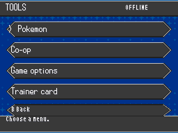
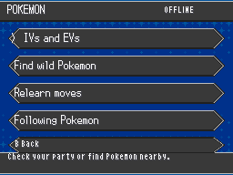
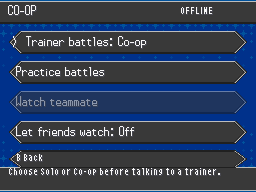

# Co-op tools

Unova Together by mvq1303 / WhatWasMissing.

Open **Players → Tools → Co-op**. Select a teammate in Players first for
actions involving another player. These additions need the updated presence
relay; an older relay still supports its existing features.

- **Watch a battle:** the battler must enable **Let friends watch**. Select
  them in Players, then choose **Watch teammate**. The separate window is a two-frame-per-second
  preview of both DS screens, with no controls. Sharing is off by default and
  ends when the battle ends, sharing is disabled, or either player disconnects.
- **Followers:** open **Players → Tools → Pokémon → Following Pokémon** to toggle
  your own following Pokémon or hide teammates' followers.
  Nearby companions can greet each other with a short animation.
- **Practice battles:** opens the existing challenge catalog. Choose **Practice**
  for a non-progressing battle; it does not award badges or story progress.

NPC assistance retains the existing invitation and dialogue hold: choose Join,
then reach the matching trainer in your own game. Each original story script
keeps ownership of its own result and rewards. The invitation explains when LAN
is missing, and teammate status distinguishes menu, waiting and preparation.

## Limits

Battle previews are intentionally low-bandwidth snapshots, not full-motion
streaming. Busy render locks and backed-up sockets drop preview frames instead
of waiting. Some accelerated renderers may not supply a current CPU framebuffer;
use the software renderer if previews are blank or stale. No battle packets or
game inputs are sent through preview messages.

Extra challenge-rule enforcement, spectator control and coordinated fainting
rules are not part of these tools. Neither game is given authority over the
other player's story flags or save.

## Menus

